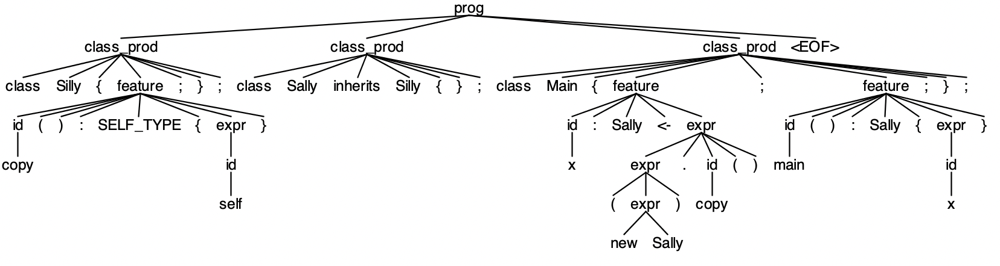
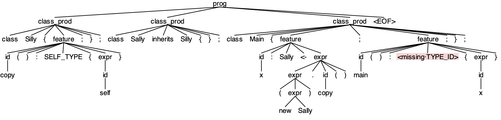

# Construcción de Compiladores

### Laboratorio 0

Este laboratorio consiste en la creación de un parser para YAPL. La herramienta escogida fue ANTLRv4.

La gramática está contenida en `YAPL.g4`, es necesario compilarla con 
```bash
antlr4 YAPL.g4 && javac YAPL*.java
cat tests/FILE_NAME.YAPL | grun YAPL prog -gui
```

En caso no se encuentren errores, se mostrará el arbol de análisis sintáctico de la siguiente manera:




Si existen errores léxicos o sintácticos, el algoritmo de recuperación los reconoce y trata de continuar con el input de la mejor manera posible (siguiente token en modo pánico o insertando la mejor opción):



Ambos ejemplos corresponden a `tests/self_type.YAPL`

El **video** demostrando el funcionamiento del proyecto está disponible en [este link](https://youtu.be/IOQdCduloXw).

<!-- <iframe width="560" height="315" src="https://www.youtube.com/embed/IOQdCduloXw" title="YouTube video player" frameborder="0" allow="accelerometer; autoplay; clipboard-write; encrypted-media; gyroscope; picture-in-picture" allowfullscreen></iframe> -->

### Configuración ANTLR

Es necesario agregar el siguiente fragmento al entono


```bash
export ANTLR_HOME="$HOME/ANTLR-4.10.1"
export ANTLR_JAR="$ANTLR_HOME/antlr-4.7.2-complete.jar"
export CLASSPATH=".:$ANTLR_JAR:$CLASSPATH"
alias antlr4="java -jar $ANTLR_JAR"
alias grun="java org.antlr.v4.gui.TestRig"
```

Esto habilita los comandos `antlr4` y `grun` para las sesiones futuras.


### Laboratorio 1

Para correr el laboratorio:

```
python3 main.py input.yapl
```
### Video Laboratorio 1

https://youtu.be/nwIqlAE828g
